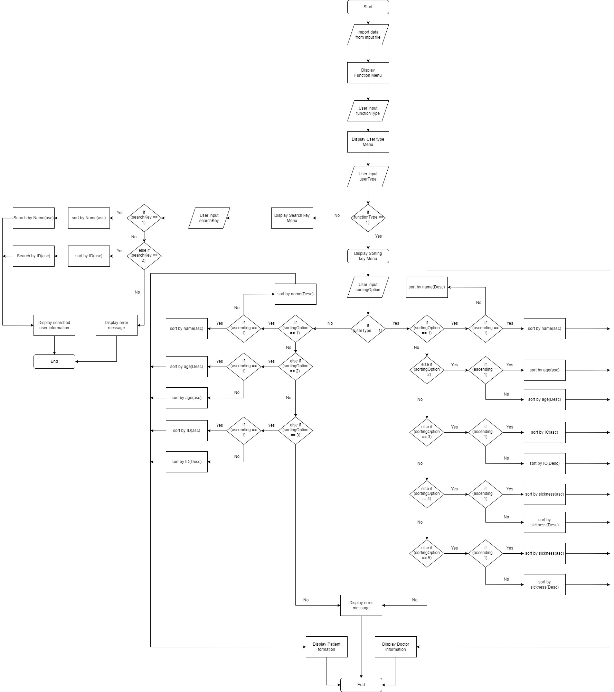

# Hospital Reservation System 

## Objectives

To provide easy management system for to record patient and staff of hospital.
To provide sorting and searching function in the system.
To provide efficient and effective with high accuracy in sorting and searching by implemented data structure algorithm.

## Synopsis

A hospital management system is a system which develop to provide efficient to manage a large data with high accuracy. We implemented various data structure algorithms in this system which give the high performance. This system allowed user to sort in ascending and descending and also to searching by name or IC or ID. Before the search process the system will sort the data according to key user choose. So this make the searching more faster.

## Flow Chart

## Sorting Algorithm

The sorting algorithm is implemented by class of sorting which contain all sorting function which sort by specific key such as name, age, Ic or Id and so on. In order to sorting user need to select first either they want to sort the patient or doctor. Then user need to select key to sort the data and order to sort the data, ascending or descending. The data is upload from txt file for both patient and doctor. To sort this, we use insertion sorting algorithm which give a highly effective and efficient in term of performance. After done choose the key the system will perform sorting by specific function in the class sorting provided. In the end of the process the the system will display all the patient or doctor information according to the user choose earlier.

## Searching Method

The searching process mechanism for our system, implements standalone searching functions. A menu is displayed to allow for the user to pick a searching option. The first menu is to search by Doctor or Patient. The second menu is to search by Name or IC. Our functions have passing parameters of the actual class array(Patient/Doctor), search key that will be inputted by the user and the class array size. The content of our function includes first, the initialisation of the variable “idx” which is an integer datatype. It functions as an index that will be returned back to the main function, which signifies the index of the identical ID/Name of Doctor/Patient, when compared to the user's search key. There is a for loop that will loop through the class array while checking at each index, whether the search key matches the determined element that will be compared to. If matching data is found, the “idx” will be returned signifying, matching data is found. Else, the function returns -1 to signify, no matching data is found. After returning the idx, the display function of class will be called to display the details of searched key to the user.

