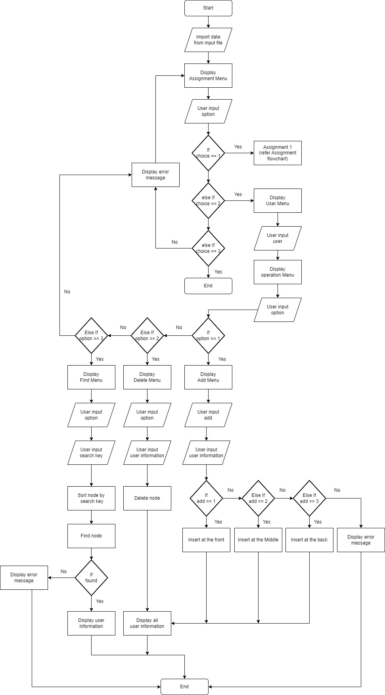

# Hospital Reservation System (ASSIGNMENT 2)

## Objectives

To provide easy management system for to record patient and staff of hospital.
To provide sorting and searching function in the system.
To provide efficient and effective with high accuracy in sorting and searching by implemented data structure algorithm.

## Synopsis

A hospital management system is a system which develop to provide efficient to manage a large data with high accuracy. We implemented various data structure algorithms in this system which give the high performance. This system allowed user to sort in ascending and descending and also to searching by name or IC or ID. Before the search process the system will sort the data according to key user choose. So this make the searching more faster.

## Flow Chart

## Delete Node Functionality
The deleteNode function allows the user to remove a node, either a Patient or a Doctor, based on their IDs. Each are specified in the code with either 'p' for patient or 'd' for doctor. The function will first scan through the respective linked list (patients or doctors) to locate the node with the matching the key, ID.

Head Node Deletion (Unlinking): 

If the node to be deleted is the first node or the head of the list, the head pointer is updated to point to the next node. If the list becomes empty, the head is set to NULL.

Middle or Last Node Deletion (Unlinking): 

If the node is in the middle or at the end of the list, the function updates the links of the surrounding nodes to allow for the node to be deleted. This is done by adjusting the next and prev pointers of nodes.

Final touches (& Deletion):

Once the node is successfully unlinked from the list, the function deletes the node. The function returns an integer (1 or 0) indicating the success of the deletion operation.
