# Hospital Reservation System (Project)

## Problem Analysis
The efficient operation of a hospital depends on the efficient maintenance of patient records. The obstacles of efficient patient record keeping in a hospital context are addressed by the Hospital keeping System. By implementing necessary data structures concepts which are stack, queue and tree, the system seeks to manage patient records effectively and guarantee a dynamic and well-organized workflow inside the hospital. 
One necessity that is particularly important is patient records management, which includes efficient monitoring of prescriptions, check-ins, and appointments. The selected data structure or structures must be implemented with precision and efficiency, and they must work in unison with the unique requirements of the hospital administration system.
The main objectives are to create a reliable software programme for managing hospitals, implement the right data structures to manage patient records, make use of the stack, queue, and tree data structure principles and ensure that C++ is used correctly to apply the data structures concepts. 
Requests for prescriptions, check-ins, and appointments will be handled using a queue-based data structure. The queue guarantees a systematic and well-organized procedure and is implemented using arrays or linked lists. In order to ensure proper record-keeping, a stack-based data structure will also preserve an updated record of daily hospital visits, using the Last In First Out (LIFO) concept. In order to support consultations, doctors will also be seamlessly added to the system, adding to a comprehensive approach to healthcare management.
Among the difficulties the system will face include effectively allocating waiting numbers for appointments, ensuring that the check-in procedure is organised according to waiting numbers, and putting in place a memory-clearing mechanism for when the system shuts down. The data structure concept that will be applied will be implemented to solve the difficulties that the system is facing.

## Objectives

### Patients should be able to request appointments, check in, and receive prescriptions using a queue-based data structure to manage appointment requests, patient check-ins, or prescription requests. This will maintain order in the check-in process based on waiting numbers.
### The system aims to manage patient records efficiently by incorporating a stack-based data structure for maintaining an updated record of daily hospital appointments. This will help in memory-clearing during system shutdown.
### Patient record organization is a critical aspect, and we achieve this through the implementation of a Tree structure by utilizing the Binary Tree concept. This is to ensure efficient sorting, retrieval, and deletion of patient records, allows for systematic arrangement of patient record.

## Flow Chart

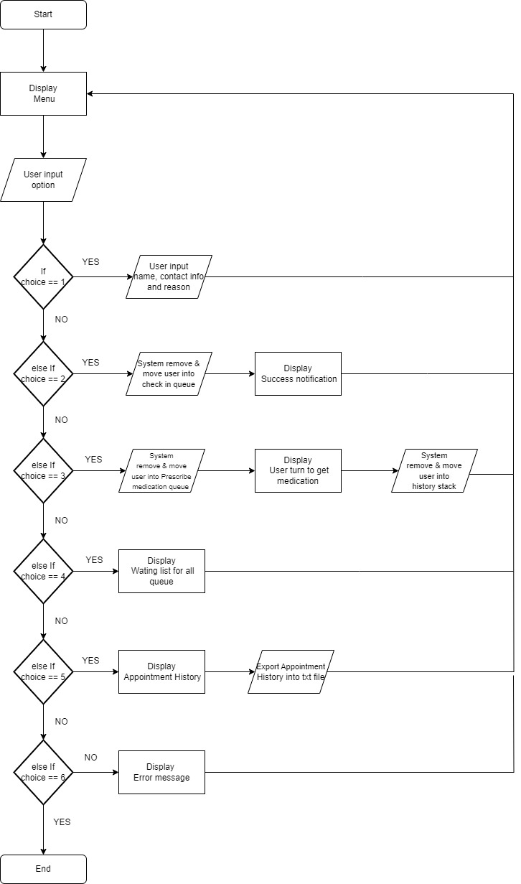

## Data structure concept implementation

## Queue : Appointment system 
Effective patient record management in a hospital is the goal of the hospital management system. The implementation of queues using linked lists ensures a dynamic and scalable approach to manage medication prescriptions, check-ins, and appointments. The Hospital Management System is designed to handle patient appointments, check-ins, and prescriptions. Queue functions are implemented in the system to handle appointments requests, patients checking-in and medicines prescription. Patients are able to check in, make appointment requests and get prescriptions filled. Doctors are added to the system so that patients can consult with them. The system uses a queue-based data structure to monitor prescriptions, check-ins, and patient appointments. A linked list is used to implement each queue, with each node representing a patient or physician. Patients who request an appointment are given a waiting number, and lines are kept orderly and organised. The system makes sure that patients are only able to check in if their waiting number corresponds with the expected waiting number.

## Stack : Appointment History
In this hospital management system, where we focus on the appointment system, a Stack was created to retain an updated record every day of the hospital appointment. It also employs a linked list to offer an infinite size to hold many patients in a day of appointment operation. This stack will automatically add patients who have completed their visits and received their prescribed medicine into it. Furthermore, the stack adheres to the Last in First Out (LIFO) principle, which states that the most recent patient added to the stack is the first to be withdrawn. With this stack, we also include a function that generates a report of the appointment history, including all patient information. This report will be generated before the system is closed down. After the report is generated the stack element will pop one by one until empty to clear the memory.

## Tree : 

## User guideline
This system focuses on part of the hospital's function. So we Focus on the appointment system. The system is easy to learn and easy to use with one click all operation is completed. Almost all operations are automated by the system.

### 1. Make Appointment
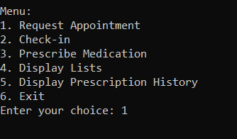
1. The system will display a menu.
2. Choose (key in 1) to add a new appointment.

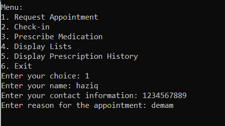

3. Insert Patient name, contact information, and reason for appointment.
4. Press enter

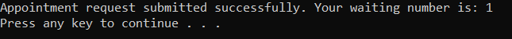

5. The system will display a success notification that means that the appointment has been added.

### 2. Check-in for an appointment.

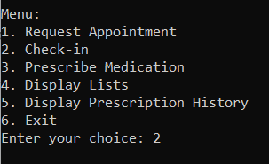

1. The system will display a menu.
2. Choose (key in 2) option 2 to check in for an appointment (Check means that the patient gets ready to make an appointment).

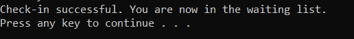

3. The system will display a success message to notify that the patient has a successful check-in. 
4. The patient will be in a waiting queue for the next check-up.

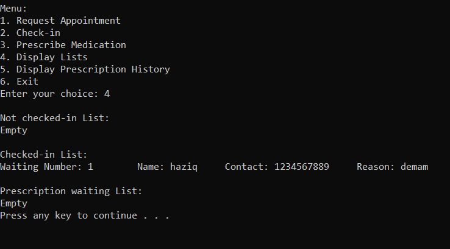

5. You can check if the user is in the queue by keying in option 4 in the menu. (you do this with other operations to check if the user is added to the queue or not)

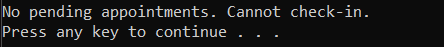

6. If you got this message means that there is no patient in the queue so cannot do the operation.

### 3. Call the patient to get a Medication prescription

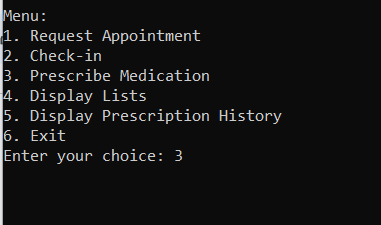

1. The system will display a menu.
2. Choose (key in 3) option 3 to move the patient in the queue to get medication after the doctor's discussion.
3. The system will automatically remove patients that have got their medication.

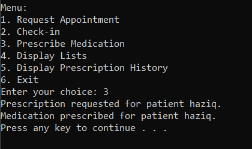

4. The system will display a success message of the patient getting a turn to get medication and the medication that the patient is given.

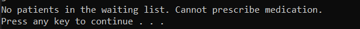

5. If you got this message means that there is no patient in the queue so cannot do the operation.

### 4. Check the waiting list queue

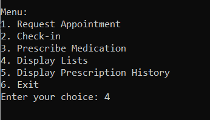

1. The system will display a menu.
2. Choose (key in 4) option 4 to look at all the waiting queues.

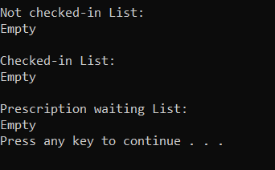

currently no patient in the list.
3. The system will display all the waiting queues for patients that have not checked in yet, have checked in, and are waiting to get medication.

### 5. To view the history of the Hospital appointment

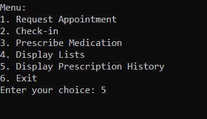

1. The system will display a menu.
2. Choose (key in 5) option 5 to view the list of all patients that do a discussion with the doctor. 

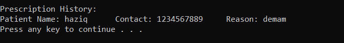

3. The system will display all the Patients that have made the appointment only.

### 6. To export the history of the appointment hospital.

1. The system will display a menu.
2. Choose the (key in 5) option which will display all patients that have done an appointment.

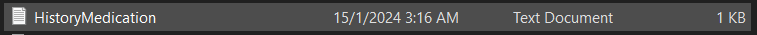

3. The system will automatically export data into a text file.
4. You can find the txt file in the C directory in folder History.

### 7. End the program

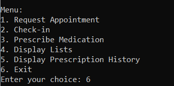

1. The system will display a menu.
2. Choose (key in 6) option 6 to exit the system.
3. The system will remove all the patient records that are still in the queue and the history.

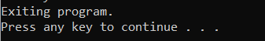

4. The system will display a message before the end of the program

