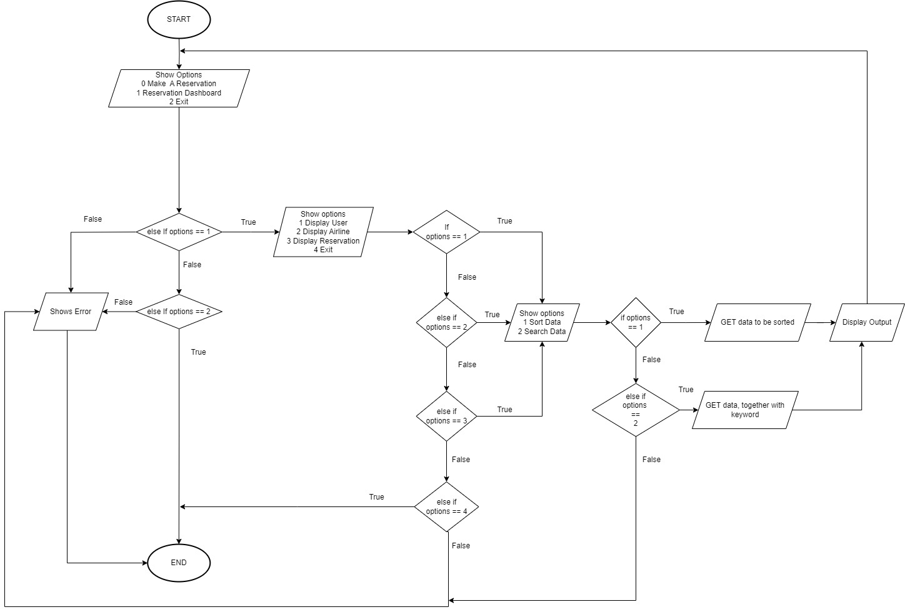

# Airline Reservation System ✈️

## Objectives 🌈

The purpose of this system is to provide an easy-to-go administration reservation system for the admins looking to monitor customers ticketing purchases. We boil down our system to only one function because that is the main function that most administrators will use when tinkering with monitoring aeroplane tickets.

The goal that we wish to achieve here is a efficiently aid administrators in analyzing the number of people using our aeroplane ticketing system while simultaneously being better able to see our code implementation in real-life exemplars. Providing efficient sorting and searching methods and checking their available database will not be a hassle.

## Synopsis 📜

There are three categories of sorting and searching functions that we implement that being; airlines, reservations and users. In each of these categories/classes, there are more than 3 data that are associated with them. For example, in airline classes, the data types are name, IC, phone and email, and users can sort and search according to these data(s) only. In Reservation cases, there are the data types of AirplneID, Company and Capacity. Whereas for Users classes, there are the data types of ReservationID, DepartureTime, ArrivalTime, Date, Location and Class. 

For our reservation dashboard, this function is basically like a reservoir of information regarding people who are booking their aeroplane tickets. This function allows administrators to sort the database of those who purchased their tickets according to the available option. The type of sorting system that we apply is the quicksort method, henceforth it is efficient and time-saving.

## Flow Chart 📑

## Sorting Algorithm 📟

The sorting algorithm that we choose to implement is the quicksort method. The reason for this is that such a real-life system which handles a large amount of data(s), is not suitable to use simple sorting methods such as bubbleSort or InsertionSort. Whereas implementing the MergeSort function is not as efficient as the Quicksort function. 

First, we ask the user through which class he wishes to sort in. Given that only three available options are being; airlines, reservations and users. Each of these classes has a quicksort function of their own. Once the choices have been made, the sorting method will begin to proceed.

The quicksort function is divided into further two functions which are quicksort and partition functions. The partition function is a divide function according to the pivot value, a and we use. The pivot value is constantly moving up and down the vector throughout the process until finally, it is within its right place. The outcome of this partition function will be stored inside the pivot value. 

Afterwards, we will go through the quicksort function again, in a recursive manner. During the partition method itself, the data will be sorted according to the right order. 

## Searching Method 👀

The search algorithm that we apply is a binary search method. The reason why we choose binary over sequential compared to binary search begins in the middle and then breaks into smaller chunks, whereas the normal searching method begins at the front and goes through each data., It is also an efficient way of finding items that have been sorted initially.

We have a function called search by key. This means that the user will provide their input for the things that they wish to search such as name, Ic, company name etc, and then our function will search through our database to find the matching request. 

