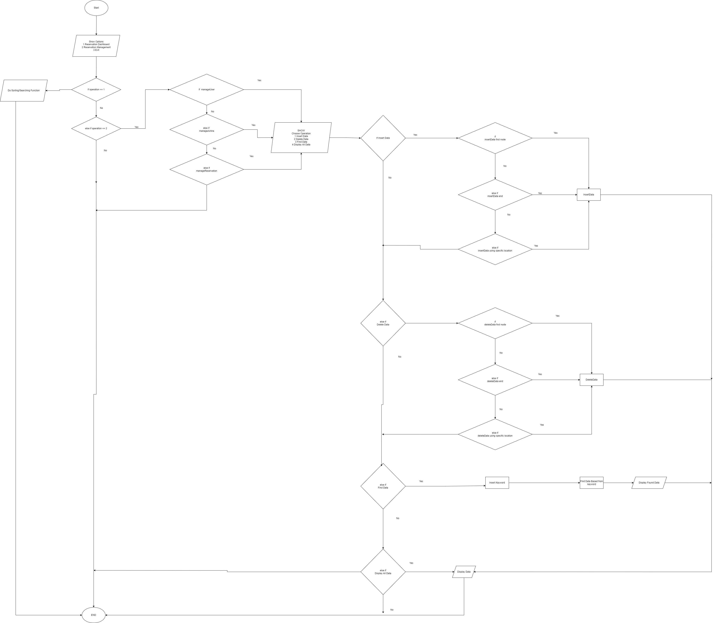

# Airline Reservation System ✈️

## Table of Content
- [Description](#description-)
- [Objectives](#objectives-)
- [Synopsis](#synopsis-)
- [Flow Chart](#flow-chart-)
- [Linked List](#linked-list--%EF%B8%8F-)

## Description 
For this part of assignment work we are going to implement linked list method in upgrading the functionalities of our airline reservation system. From the existing system that implements vector use, we are now required to prove another method of navigating through our system by the linked list method and perform a link-up with our previous vector algorithm.

## Objectives 🌈
The main objective of this assignment part is to show the implementation of a linked list. As we know, a linked list is a dynamic form of data store. It does not have a specified limit to the number of nodes that can be added. 

We have implemented vectors as our main way to store multiple data strings. Vector is a dynamic form of data store, too. This poses a challenge to us on how to interlink both different methods as they both have their structured way of inserting/deleting/finding data(s). By providing a solution to the poses challenge, we will be better able to make our system longevity last longer as the way the system handles data is mostly under dynamic condition

## Synopsis 📜
There are several updated functions we implement throughout. Namely, each class/main function has its own list function. 

Take reservations, for example. This class now have an extra class closely related to it called “reservationList”. This is where the linked list method is mostly implemented. We have several basic key features such as insertFirstNodeReservation, deleteFirstReservation, findNode, isEmpty, and display function. 

Because we implement vectors beforehand, it is very difficult for us to work with linked lists as they both have dynamic structures. However, we managed to counter this problem by inserting first inserting the value of the linked list into a vector and then updating it into a file.

The data that have been added/removed through the linked list will now be pushed/removed to/from the vector list. 
 

## Flow Chart 📑

## Linked List 📦 ➡️ 🛑

## Reservation Section 📅

### InsertNode in reservationList Class

For insertNode we implement as usual, whereby we have to  pointers both curr and prev. We also take all the parameters for that specific class as logical; if the user wants to insert new data, they should insert all the booking details.  This function already sorts the incoming new data by comparing the existing data in the linked list with the incoming linked list. 

Now, assuming that we have found the right position to insert the new Node, we will determine if we want to add it to the front or to the middle/back of the list. Once done, we will return the new node. 

This function will be paired up with the updateCSV function. Whereby we will use the newly added linked list in the CSV file. Ironically, this will also update our vector list.  This function is also interconnected with another function: new data.  newData function will append this new node to the CSV file.  

### DeleteNode in reservation Class

In this function, we implement the usual delete linked list code whereby we have two nodes, both curr and prev. For this function, we only take one parameter for the user to enter to delete their data: their reservation. We have to make sure that every reservation is unique of their own and it serves as the primary key itself.

This function is coupled with the deleteData function, whereby this function takes the argument given by the user and deletes that specific data from a CSV file. We do this by transferring all the data(s) that do not match with the argument of user,to a temporary file which we then rename it to our original csv file.	

### FindData in reservationList, userList, AirlineList

We implement the link list method for the find node function. Whereby we do not interfere with our vector list. We take one string, which is their reservation. We have one pointer called curr and point it to the head of the list. Next, we will swiftly through the list and see if we can find a match and update the current position in each iteration. If we do, we will display that matching data; if not, we will return 0. 

Write a report that includes an objective, a synopsis, a design (class design in a class diagram and algorithm design in pseudo code/a flow chart), and a description of how data structure operations, sorting and searching are implemented.

### DisplayData in reservationList

For display data, we have one pointer curr pointing towards the head. Afterwards, we update this current data in each iteration. Each curr points towards the string of the class data.

## User Section 🛂

## User Section

Inside `UserList` class, we have designed it to manage our linked list that uses the paramerters in the `User`. This create nodes that we have given the option insert, delete, find and display the node.

### Update Funtion ###

1. **updateNodeUser** : This fucntion is used in our code to transfer the data in `user.csv` which is in vector to linked list by converting them to nodes so that insert, delete can function properly.

### Insert Funtion ###

1. **insertFirstNodeUser** : This function method creates a new `User` node and inserts it at the beginning of the linked list. It functions by taking the data of `Name`, `IC`, `Phone number` and `Email` and intiliazing it to a new node the this node will be point `next` to the existing `head` of the linked list. Then it will update the value of `head` to be the `newNode`. This algorithm is used to make sure any new data will always be put at the top of the data file in which `NewDataUserFirst` is used to update the existing data of `User`.

2. **insertMidNodeUser** : This method created a new `User` node and inserts it to a specific `location` that in inputted by the user.  Firstly it will validate whether the `location` is valid or not. If a valid `location` is detected it will traverse to said location of the node. Now if the value of `location` is the first node, the same algorithm will be used as in `insertFirstNodeUser` but if the `location` is within the middle of the list, the new node will be inserted between the `prev` and `curr` nodes. If the `location` exceeded the length of `User` list, the new node will be inserted at the end of the list.

3. **insertEndNodeUser** : This function adds a new node at the end of the list by creating a new `User` node. If the list is empty `head == NULL`, it will set the `head` to the new node. If the list is not empty, it will traverse to the end of the list and set the `next` pointer of the last node to the new node.

### Delete Function ###

1. **deleteFirstNodeUse** : This fucntion removes the first node of the list. It sets a temporary pointer to the current `head` then update the `head` to the next node in the list. Next, it will delete the node pointed to `temp`. This is ultimately removes the first element from the list.

2. **deleteMidNodeUser** : This function deletes an existing `User` node in the list based on mathing the data of `IC` in the `user.csv` file. The algorithm will traverse the lsit going throught each node of `IC` whith the inputed `IC` by the user. When match is found and it is not the first node, it will adjust the `next` pointer of the `prev` node to bypass the current node and removing it from the list. If the the nide is the first node, it will update `next` to point to the next node then it will be deleted.

3. **deleteBackUser** : To delete the last node in the list, it will travserse through the list while keeping track of the current and previous node. Once the end is reached where the next = NULL, it will sets the `next` pointer of the second to last node `stay = NULL` and deletes the last node `temp`.

### Find Data Function ###

1. **findUserNode** : This method in the `UserList` class searches for a user in the linked using the user's `IC`. It will go throught each node in the list and checks if any of the node in `IC` matches the inputted value from the user. If a matching node is found, it will display the User's detail with its `Name`, `IC`, `Phone Number` and `Email`. While if no mathing values is found it will display a message stating the inputted IC value is invalid.

### Display Function ###

1. **displayUserList** : This method will display all the existing data in `user.csv` which exist at the nodes. It will begin from the `head` of the list and uses a while looping algorithm to go through each node in the list. For every node it will print the `Name`, `IC`, `Phone Number`, and `Email` of User. After displaying the information of a node, it will proceed to the next node in the list until the end of the list has been reached.

## Airline Section 🛫

The `AirLineList` class, designed for managing a linked list of `Airline` nodes, provides various methods for inserting and deleting nodes.

### Insert Functions:

1. **insertFirstNodeAirline:** This method creates a new `Airline` node and inserts it at the beginning of the linked list. It initializes the new node with the provided `id`, `capacity`, and `company`, then sets this node's `next` pointer to the current `head` of the list. Finally, it updates `head` to point to the new node. This method effectively adds the new airline data at the very start of the list.

2. **insertMidNodeAirline:** This method inserts a new node at a specified location within the list. It first checks if the location is valid. If valid, it traverses the list to reach the desired position. If the location is at the start, the new node is added similar to `insertFirstNodeAirline`. If the location is within the list, the new node is inserted between the `prev` and `curr` nodes. If the location exceeds the length of the list, the new node is simply added at the end.

3. **insertEndNodeAirline:** This method adds a new node at the end of the list. It creates a new `Airline` node and, if the list is empty head = NULL, sets the `head` to this new node. Otherwise, it traverses to the end of the list and sets the `next` pointer of the last node to the new node.

### Delete Functions:

1. **deleteFirstNodeAirline:** This method removes the first node of the list. It sets a temporary pointer to the current `head`, updates `head` to the next node in the list, then deletes the node pointed to by the temporary pointer. This removes the first element from the list.

2. **deleteBackNodeAirline:** To delete the last node, the method iterates through the list, keeping track of the current and previous nodes. Once it reaches the end where the next = NULL, it sets the `next` pointer of the second-to-last node (`stay`) to `NULL` and deletes the last node (`temp`).

3. **deleteMidNodeAirline:** This function deletes a node based on a matching `AirplaneID`. It traverses the list, checking each node's `AirplaneID` against the provided ID. If a match is found and it's not the first node, it adjusts the `next` pointer of the previous node to bypass the current node, removing it from the list. If the node to be deleted is the first node, it updates the `head` to point to the next node. The node is then deleted.

### Find Data Functions:
The findAirplaneNode method in the `AirLineList` class searches for an airplane in the linked list using a given `AirplaneID`. It goes through each node in the list and checks if the node's `AirplaneID` matches the one being searched for. If a matching node is found, it displays the airplane's details, including its ID, capacity, and company. If no matching airplane is found by the end of the list, it displays a message stating that no airplane was found with the given ID.

### Display Functions:
The displayAirplaneList funtion in the `AirLineList` class iterates through a linked list of `Airline` nodes, displaying the details of each node. It starts from the `head` of the list and uses a `while` loop to go through each node. For every node, it prints the `AirplaneID`, `Capacity`, and `Company` . After displaying the details of a node, it moves to the next node in the list. This process continues until all nodes in the list have been displayed.

